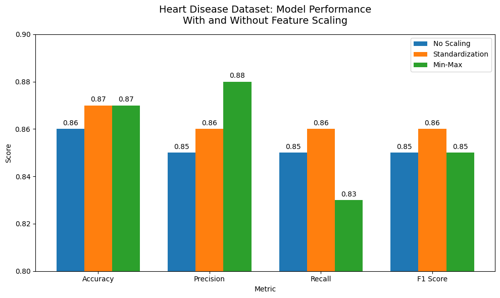
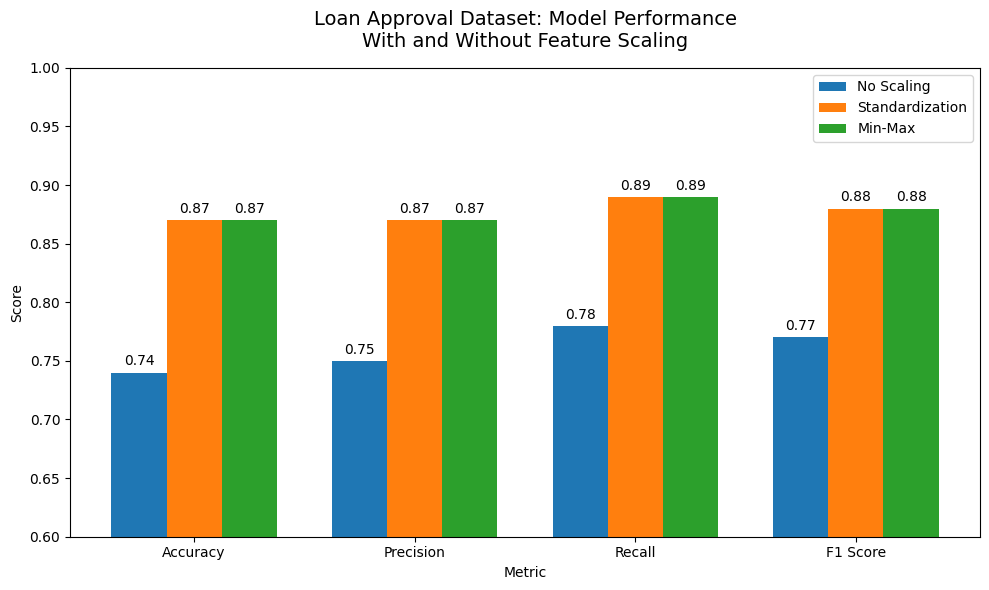
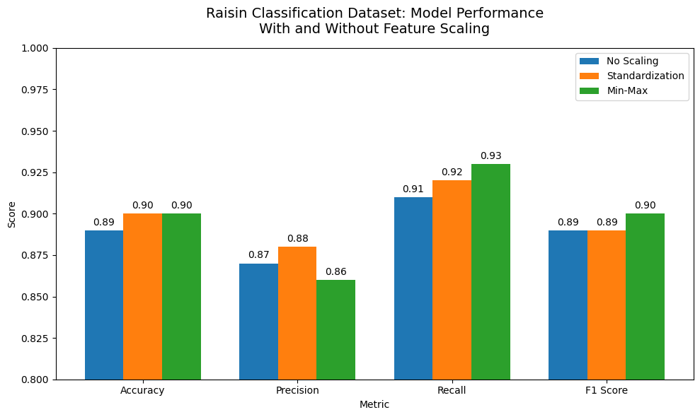

# Feature Scaling and Logistic Regression

## Overview

This project investigates the impact of feature scaling techniques on logistic regression model performance across multiple classification datasets.

## Datasets

- Heart Disease Cleveland Dataset
- Loan Approval Dataset
- Raisin Classification Dataset

## Scaling Techniques

- No Scaling
- Standardization
- Min-Max Scaling

## Technologies

- Python
- Pandas
- NumPy
- Scikit-Learn
- Matplotlib
- Google Colab

## Results

The study demonstrated that feature scaling can significantly improve logistic regression performance when features vary widely in magnitude.

### Heart Disease Dataset

---

### Loan Approval Dataset

---

### Raisin Classification Dataset

## Repository Contents

- `paper.pdf` - Full research paper
- `notebooks/` - Experimental notebook
- `data/` - Datasets used in the study

## Authors

-Santiago Rocha
-Hayden Rose
